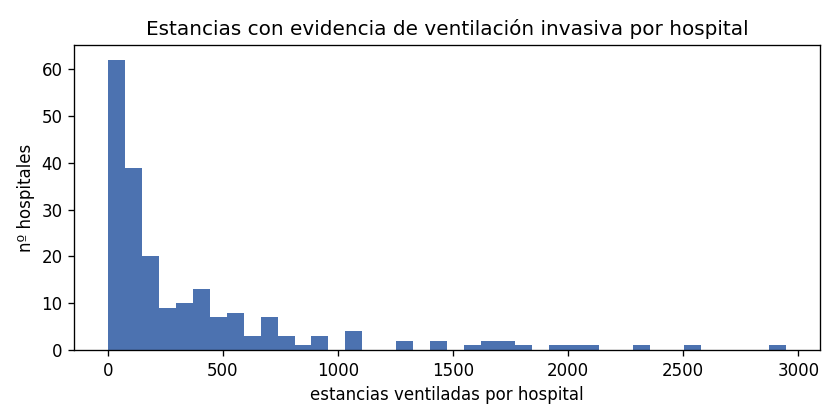
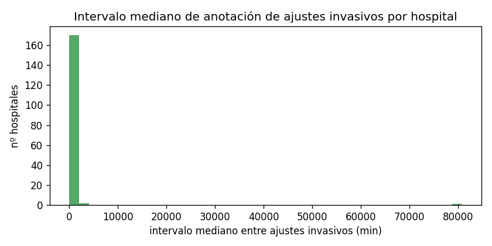

# Fase 1.6a — Auditoría de eICU y censo por hospital

> ⚠️ **Censo corregido en la Fase 1.6a-bis** → `reports/fase1_6a/resumen_v2.md`.
> El censo de este documento usa `apache_vent` (`oobVentDay1`), que incluye VNI; la
> versión corregida usa `apache_intub` (`oobIntubDay1`), mide la cobertura por
> variable y recalcula los escenarios sobre estancias utilizables
> (`eicu_hospitales_v2.csv`, `eicu_scenarios_v2.json`, `eicu_plausibilidad.json`).
> La auditoría documental y el inventario de etiquetas de este documento siguen vigentes.

> **Alcance:** medir, clasificar y proponer. **No** se han calculado etiquetas
> de desenlace (ni reintubación, ni mortalidad, ni duración) ni se ha aplicado
> ningún filtro. La selección de hospitales la decide el investigador con estas
> cifras.
>
> Universo: **200 859** estancias de UCI en **208** hospitales; **74 638**
> estancias con evidencia de ventilación invasiva (al menos una bandera).

---

## 1. Conclusiones de la auditoría

Fuentes y contraste completo en `eicu_auditoria.md`. Resumen de estados:

| # | Afirmación | Estado |
|---|---|---|
| A1 | `ventendoffset` es 0/nulo en ~99,98 % de `respiratoryCare` | **Confirmada** (865 224/865 381 = **99,9819 %**; 1 sola estancia con `> 0`) |
| A2 | El fin de ventilación debe derivarse de `respiratoryCharting` | **Confirmada** (ajustes invasivos en 56 075 estancias) |
| A3 | El método hay que validarlo **por hospital** | **Confirmada** (dispersión enorme, §4) |
| A4 | `oOBVentDay1=1` sin `oOBIntubDay1=1` ⇒ VNI | **Confirmada** (12 000 estancias; 0 en el sentido inverso) |
| A5 | `airwayType` es un *picklist* de vía aérea | **Confirmada** (Oral ETT 8 110 est./92 hosp.; Tracheostomy 1 028/62) |
| A6 | `respChartOffset` ≠ `respChartEntryOffset` | **Confirmada** (solo 74,91 % iguales; p90 = 47 min) |
| A7 | `treatment` «…\|mechanical ventilation» marca VM invasiva | **Confirmada** (41 063 estancias) |
| A8 | Criterio mechanical-power (≥10 pac. y ≥10 % con pico en 24 h) | **Confirmada** (escenario a: 65 hospitales) |
| A9 | La documentación varía entre hospitales | **Confirmada** (§4) |
| A10 | Peine et al. 2021 derivan ventilación en eICU y usan Q-learning | **No comprobable** en detalle (se cita como referencia) |

**Hallazgo clave (no estaba en las fuentes, verificado en local):**
`ventstartoffset` **no marca la intubación**. De las estancias con
`ventstartoffset > 0`: solo **23,42 %** tienen `airwayType` Oral/Nasal ETT,
**61,05 %** `oobVentDay1=1`, y **solo el 1,72 %** tiene el primer ajuste
invasivo de `respiratoryCharting` a **±2 h**. `ventstartoffset` parece registrar
la conexión al equipo de oxigenoterapia/ventilador sin distinguir la vía aérea
⇒ **no debe usarse como criterio de inclusión**.

---

## 2. Inventario de etiquetas (`eicu_vent_labels.csv`)

278 etiquetas/valores con nº de estancias y hospitales, clasificadas:

| Categoría | Nº de etiquetas |
|---|---|
| **invasiva** | 51 |
| **VNI-alto flujo** | 26 |
| **oxigenoterapia** | 40 |
| **ambigua** | 161 |

Ejemplos destacados (estancias / hospitales):

- **Invasiva**: `apachePredVar.oobVentDay1=1` (56 530/205),
  `carePlanGeneral` «Intubated/oral ETT» (47 519/205),
  `airwayType` «Oral ETT» (8 110/92), «Tracheostomy» (1 028/62).
- **VNI-alto flujo**: `carePlanGeneral` «Non-invasive ventilation» (21 637/203),
  `respchartvaluelabel` «PEEP/CPAP» (5 407/48), «CPAP» (3 074/61).
- **Oxigenoterapia**: `nurseCharting` «O2 Saturation» (166 113/202),
  `respchartvaluelabel` «FiO2» (75 234/177), «LPM O2» (54 561/113).

> La clasificación se implementa en `src/common/eicu_vent.py`
> (`classify_respchart_label`, `classify_airway`, `classify_treatment`,
> `classify_careplan`). Ajuste relevante: «Not intubated/…» **no** es invasiva.

---

## 3. Evidencia de ventilación invasiva por estancia y concordancia

Banderas independientes (una estancia puede tener varias):

| Fuente | Bandera | Estancias |
|---|---|---|
| APACHE `oobVentDay1` | `apache_vent` | 56 530 |
| APACHE `oobIntubDay1` | `apache_intub` | 44 530 |
| `respiratoryCare.airwayType` ETT | `airway_ett` | 8 149 |
| `respiratoryCare.airwayType` traqueo | `airway_trach` | 1 028 |
| `respiratoryCharting` (ajuste invasivo) | `rc_invasive` | 56 075 |
| `carePlanGeneral` (Ventilation/Airway invasiva) | `cpg_vent` | 51 642 |
| `treatment` (mechanical ventilation) | `tx_vent` | 41 063 |

**Estancia con evidencia de ventilación invasiva = al menos una bandera**:
**74 638** (de 200 859).

### Matriz de concordancia (kappa de Cohen)

`kappa` = sobre el universo completo (200 859); `kappa_unión` = sobre la unión
de positivos (set informativo). Pares con mayor acuerdo:

| Par | both | only_a | only_b | Jaccard | kappa | kappa_unión |
|---|---|---|---|---|---|---|
| `apache_intub|apache_vent` | 44 530 | 0 | 12 000 | 0.788 | **0.842** | 0.000 |
| `apache_intub|cpg_vent` | 42 862 | 1 668 | 8 780 | 0.804 | **0.857** | -0.056 |
| `cpg_vent|tx_vent` | 39 220 | 12 422 | 1 843 | 0.733 | **0.801** | -0.064 |
| `apache_intub|tx_vent` | 34 396 | 10 134 | 6 667 | 0.672 | 0.751 | -0.186 |
| `apache_vent|cpg_vent` | 43 895 | 12 635 | 7 747 | 0.683 | 0.742 | -0.176 |
| `rc_invasive|cpg_vent` | 42 835 | 13 240 | 8 807 | 0.660 | 0.721 | -0.195 |
| `apache_intub|rc_invasive` | 37 669 | 6 861 | 18 406 | 0.599 | 0.666 | -0.189 |
| `apache_vent|tx_vent` | 35 787 | 20 743 | 5 276 | 0.579 | 0.651 | -0.158 |
| `apache_vent|rc_invasive` | 41 138 | 15 392 | 14 937 | 0.576 | 0.626 | -0.269 |
| `airway_ett|apache_intub` | 6 919 | 1 230 | 37 611 | 0.151 | 0.208 | -0.055 |
| `airway_ett|rc_invasive` | 7 696 | 453 | 48 379 | 0.136 | 0.182 | -0.016 |

Tabla completa (21 pares) en `eicu_evidence.json → concordance`.

**Lectura:** APACHE, `carePlanGeneral`, `treatment` y `respiratoryCharting`
concuerdan entre sí (kappa 0,63–0,86); **`airwayType` es mucho más raro**
(apenas 8 149 estancias) y tiene kappa bajo, pero casi siempre es **subconjunto**
de las fuentes invasivas (solo 453 estancias con ETT y sin ajustes invasivos).

---

## 4. Censo por hospital (`eicu_hospitales.csv`)

Una fila por hospital (208), con identificación (región, docente, categoría de
camas, tipos de unidad), volumen, documentación y cobertura. **Sin columnas de
desenlace.**

Distribución (ver histogramas en `figs/`):

- **Estancias ventiladas por hospital**: muy asimétrica — desde hospitales con
  unas pocas estancias hasta 2 946 (hospital 411).
- **Intervalo mediano entre ajustes invasivos**: concentra dos regímenes claros
  — hospitales con **60 min** (anotación horaria) y hospitales con **~170–620 min**
  (anotación a demanda).




**Ejemplos de heterogeneidad documental** (top-30 completo más abajo):

- Hospital **73**: 2 510 estancias ventiladas, pero **0 %** con `airwayType` y
  solo **8,7 %** de `ventstartoffset` respaldado.
- Hospital **411**: 2 946 estancias, **92,3 %** con `ventstartoffset` respaldado,
  intervalo mediano 60 min, `vars_ok` al 50 % en 88 (pero **0,9 %** con
  `airwayType`).
- Hospital **188**: 1 711 estancias por APACHE/carePlan, **0** ajustes invasivos
  en `respiratoryCharting` (no sirve para derivar ajustes).
- Hospital **420**: 76,5 % con `airwayType` (documentación de vía aérea alta).
- `vars_ok` al 50 %: de 0 a >1 000 estancias por hospital.

---

## 5. Escenarios de selección (propuestas, NO aplicadas)

| Escenario | Hospitales | Estancias | min | P25 | mediana | P75 | máx | peso del mayor |
|---|---|---|---|---|---|---|---|---|
| **a** — mechanical-power (≥10 pac. y ≥10 % con pico en 24 h) | 65 | 31 836 | 25 | 111 | 286 | 665 | 2 073 | 6,5 % |
| **b** — ≥50 est. ventiladas, ≥80 % con ajustes invasivos, intervalo mediano ≤ 4 h | 41 | 33 497 | 89 | 241 | 559 | 1 412 | 2 946 | 8,8 % |
| **c** — como b con intervalo mediano ≤ 2 h | 20 | 16 993 | 111 | 290 | 502 | 1 124 | 2 946 | 17,3 % |
| **d** — como b y además `vars_ok` 50 % en ≥70 % de las estancias | 4 | 2 485 | 446 | 531 | 560 | 650 | 920 | 37,0 % |

- **a** replica `alistairewj/mechanical-power`: cohorte APACHE (`oobVentDay1=1`)
  con presión pico en `respiratoryCharting` en las primeras 24 h.
- **b/c/d** usan solo documentación: volumen, fracción con ajustes invasivos,
  mediana del intervalo de anotación y cobertura de variables.
- **d** es el más restrictivo (4 hospitales) y concentra el 37 % en uno solo.

IDs de hospitales por escenario en `eicu_evidence.json → scenario_hospitals`.

---

## 6. Top 30 hospitales por estancias ventiladas

`pct_apache_inv` = % de ventilados por APACHE con ajustes invasivos;
`pct_airway` = % con `airwayType`; `pct_vs±2h` = % con `ventstartoffset`
respaldado por evidencia invasiva a ±2 h; `pct_<1h` = % con el último ajuste
invasivo a < 1 h del alta; `med_gap` = intervalo mediano entre ajustes (min);
`ok50` = estancias con `vars_ok` al 50 % / con cobertura medida.

| id | región | doc. | camas | vent | invasivas | pct_apache_inv | pct_airway | pct_vs±2h | pct_<1h | med_gap | ok50 |
|---|---|---|---|---|---|---|---|---|---|---|---|
| 411 | West | f | — | 2 946 | 2 917 | 95,3 | 0,9 | 92,3 | 15,9 | 60 | 88/2917 |
| 73 | Midwest | t | ≥500 | 2 510 | 1 891 | 73,1 | 0,0 | 8,7 | 2,1 | 212 | 1270/1891 |
| 413 | West | f | — | 2 339 | 2 320 | 97,4 | 0,4 | 82,3 | 6,1 | 60 | 67/2320 |
| 420 | Northeast | t | ≥500 | 2 073 | 1 924 | 96,4 | 76,5 | 19,4 | 3,6 | 215 | 809/1924 |
| 443 | South | t | ≥500 | 2 030 | 1 836 | 94,5 | 75,4 | 23,7 | 4,4 | 60 | 0/1836 |
| 338 | Midwest | f | ≥500 | 1 937 | 1 423 | 72,9 | 4,3 | 20,5 | 2,5 | 196 | 837/1423 |
| 264 | Midwest | t | ≥500 | 1 781 | 1 507 | 84,6 | 0,0 | 12,1 | 5,2 | 45 | 1148/1507 |
| 458 | South | f | ≥500 | 1 735 | 1 664 | 97,5 | 69,7 | 41,9 | 7,0 | 60 | 395/1664 |
| 188 | South | t | ≥500 | 1 711 | 0 | 0,0 | 0,0 | — | 0,0 | — | 0/0 |
| 199 | Northeast | t | ≥500 | 1 671 | 1 442 | 89,3 | 4,2 | 12,8 | 3,2 | 185 | 0/1442 |
| 167 | West | t | ≥500 | 1 632 | 1 387 | 86,1 | 0,0 | 18,3 | 2,6 | 191 | 799/1387 |
| 252 | Midwest | t | ≥500 | 1 568 | 1 464 | 93,2 | 0,0 | 36,8 | 4,3 | 226 | 0/1464 |
| 300 | Midwest | t | ≥500 | 1 426 | 1 178 | 83,4 | 4,6 | 19,6 | 2,0 | 165 | 741/1178 |
| 243 | South | f | ≥500 | 1 412 | 1 287 | 92,6 | 0,3 | 23,3 | 4,1 | 229 | 791/1287 |
| 208 | South | f | ≥500 | 1 281 | 969 | 78,5 | 8,0 | 4,9 | 2,2 | 610 | 0/969 |
| 281 | Midwest | f | 250–499 | 1 266 | 1 246 | 98,0 | 0,0 | — | 2,0 | 618 | 0/1246 |
| 176 | — | f | — | 1 105 | 792 | 70,9 | 0,0 | 9,9 | 2,4 | 206 | 511/792 |
| 283 | Midwest | f | 250–499 | 1 052 | 1 019 | 96,5 | 0,0 | — | 2,8 | 549 | 0/1019 |
| 122 | South | f | ≥500 | 1 046 | 884 | 83,4 | 42,5 | 10,6 | 2,0 | 212 | 0/884 |
| 449 | Midwest | t | ≥500 | 1 036 | 917 | 91,3 | 1,4 | 12,5 | 3,7 | 144 | 0/917 |
| 416 | Midwest | t | ≥500 | 935 | 740 | 78,8 | 13,3 | 9,7 | 1,7 | 339 | 0/740 |
| 148 | West | f | 250–499 | 920 | 762 | 82,5 | 0,0 | 19,6 | 4,2 | 110 | 649/762 |
| 142 | South | f | ≥500 | 898 | 829 | 93,8 | 12,7 | 8,0 | 2,3 | 271 | 20/829 |
| 165 | West | f | ≥500 | 814 | 694 | 86,5 | 0,0 | 16,0 | 3,0 | 178 | 435/694 |
| 400 | West | f | 250–499 | 804 | 709 | 87,7 | 0,1 | 10,3 | 1,0 | 224 | 553/709 |
| 277 | Midwest | f | 100–249 | 772 | 756 | 98,1 | 0,3 | — | 3,0 | 552 | 0/756 |
| 183 | South | f | ≥500 | 762 | 567 | 73,5 | 53,9 | 9,9 | 4,9 | 169 | 236/567 |
| 345 | South | f | 250–499 | 727 | 538 | 73,2 | 4,5 | 16,1 | 1,6 | 208 | 235/538 |
| 157 | West | f | 250–499 | 723 | 570 | 80,2 | 0,0 | 22,4 | 6,8 | 110 | 451/570 |
| 435 | South | f | 250–499 | 703 | 0 | 0,0 | 1,1 | 0,0 | 0,0 | — | 0/0 |

> La tabla completa (208 hospitales, todas las columnas, incluidas las de
> cobertura HR/SpO2/MAP/RR/FiO2/PEEP) está en `eicu_hospitales.csv`.

---

## 7. Fuentes consultadas

Ver la tabla completa en `eicu_auditoria.md` §1. Resumen: esquemas oficiales de
eICU-CRD (`respiratoryCare`, `respiratoryCharting`, `carePlanGeneral`,
`treatment`, `apachePredVar`, `apacheApsVar`, `nurseCharting`, `patient`,
`hospital`); issues **#49**, **#82**, **#192** de MIT-LCP/eicu-code;
**Pollard et al. 2018** (Sci Data, PMID 30204154); **O'Halloran et al. 2020**
(Crit Care Med, PMID 33044284); **alistairewj/mechanical-power**
(`hospitals-with-vent-data.sql`, `ventdurations`); **Peine et al. 2021**
(npj Digit Med, PMID 33608661).

---

## 8. Reproducción

```powershell
python scripts/verify/fase1_6a/vent_label_inventory.py   # -> eicu_vent_labels.csv
python scripts/verify/fase1_6a/verify_claims.py          # -> eicu_claims.json
python scripts/verify/fase1_6a/hospital_census.py        # -> eicu_hospitales.csv, eicu_evidence.json
python scripts/verify/fase1_6a/report_extract.py         # tablas + figs/
```

Tests: `python -m pytest src/common/tests/test_eicu_vent.py src/common/tests/test_eicu_census.py -q`
(26 en verde).
